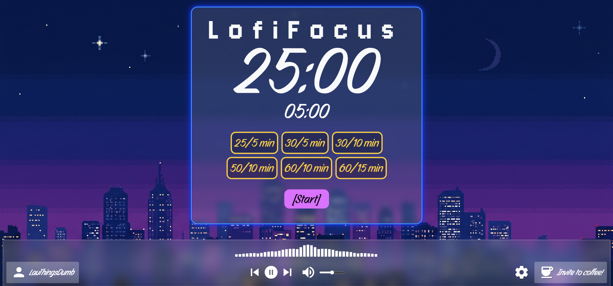

# 🎧 LofiFocus 🎧

A productivity-focused web application combining the Pomodoro technique with a lofi music player and a real-time interactive audio visualizer.



---

## Features

* ⏱️ **Customizable Timer:** Flexible work and break intervals with smooth state transitions.
* 🎵 **Music Player:** Built-in music track playback with volume control and track switching.
* 📊 **Real-time Audio Visualizer:** Dynamic graphics powered by the *Canvas API* and *Web Audio API* that react to the music.

---

## Technologies Used

* **HTML + CSS** (Flexbox, custom CSS animations, CSS variables).
* **JavaScript (Vanilla)** for timer logic, DOM manipulation, and event handling.
* **Web Audio API & Canvas API** for audio processing and visual rendering.

---

## Installation & Usage

1. **Clone the repository:**
   ```bash
   git clone [https://github.com/lauranh05/lofifocus.git]
   ```
2. **Open the project:**
    Open the index.html file directly in your browser or run it using a local development server (like Live Server in VS Code).

---

## Coming Soon...

* **Expanded Music Library:** More variety of lofi tracks to keep the focus sessions fresh.
* **Theme Customization:** Introduce advanced settings to personalize visual themes and colors to match your vibe.

---

## Author & About

* **Created by:** LauDumbThings  
* **Creation Date:** August 2026  

*Dedicated this project to myself to start studying again...*

---

## Version History

* **v1.0.0:** Basic Pomodoro timer, lofi music player, audio visualizer, and neon UI.
* **v1.1.0:** New Favicon, 

---